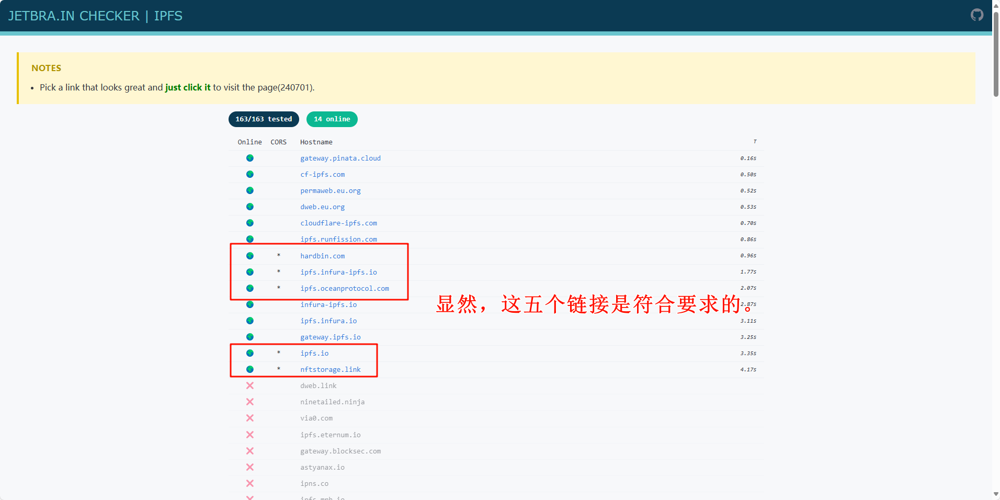
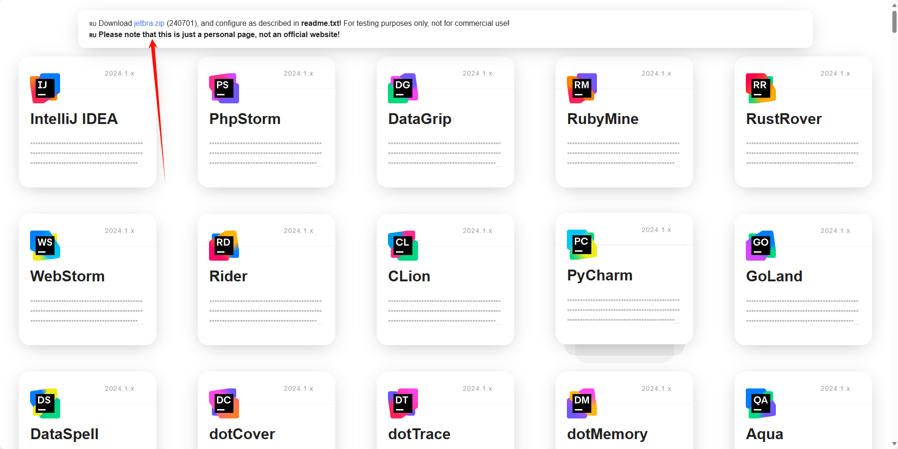
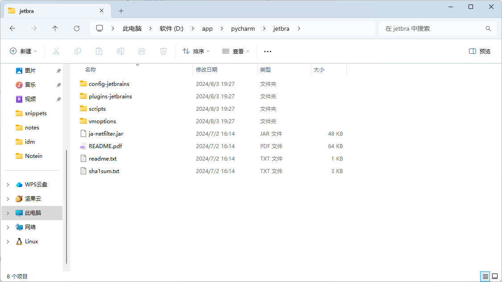
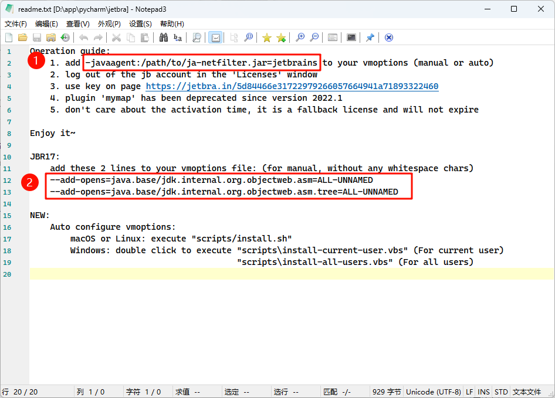
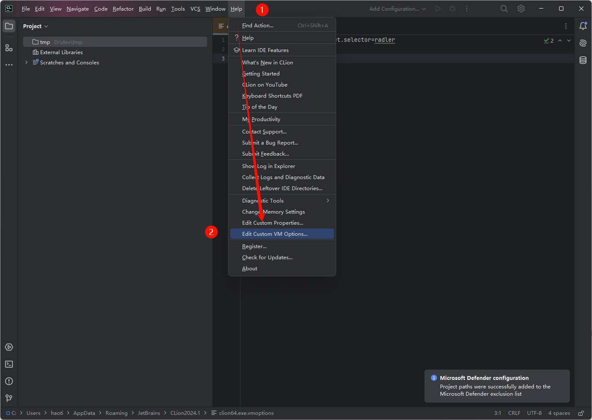
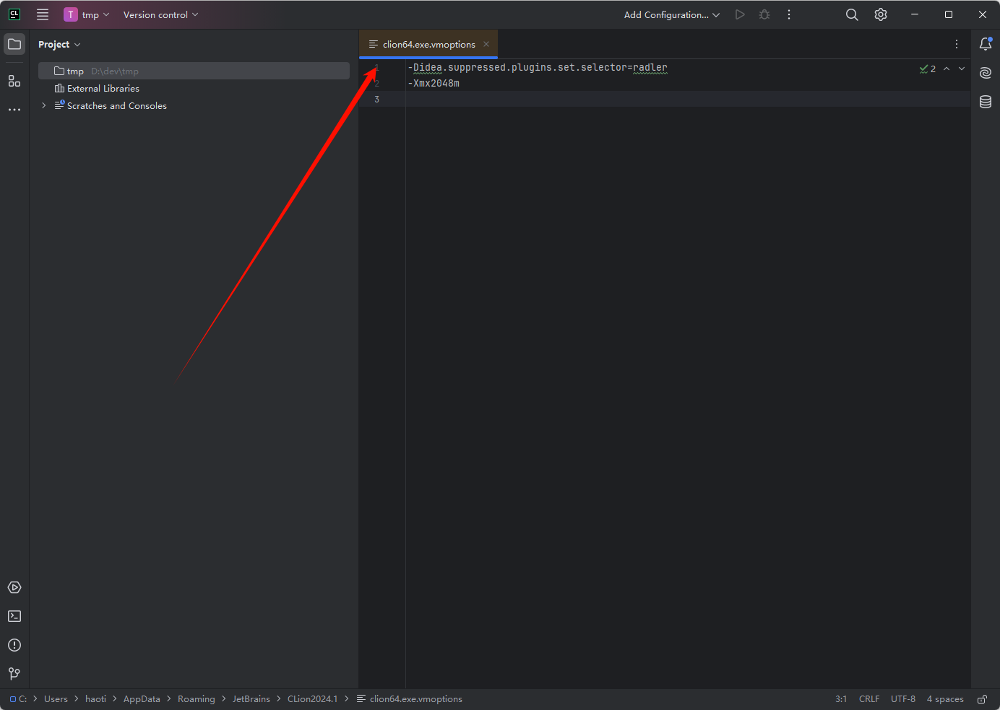
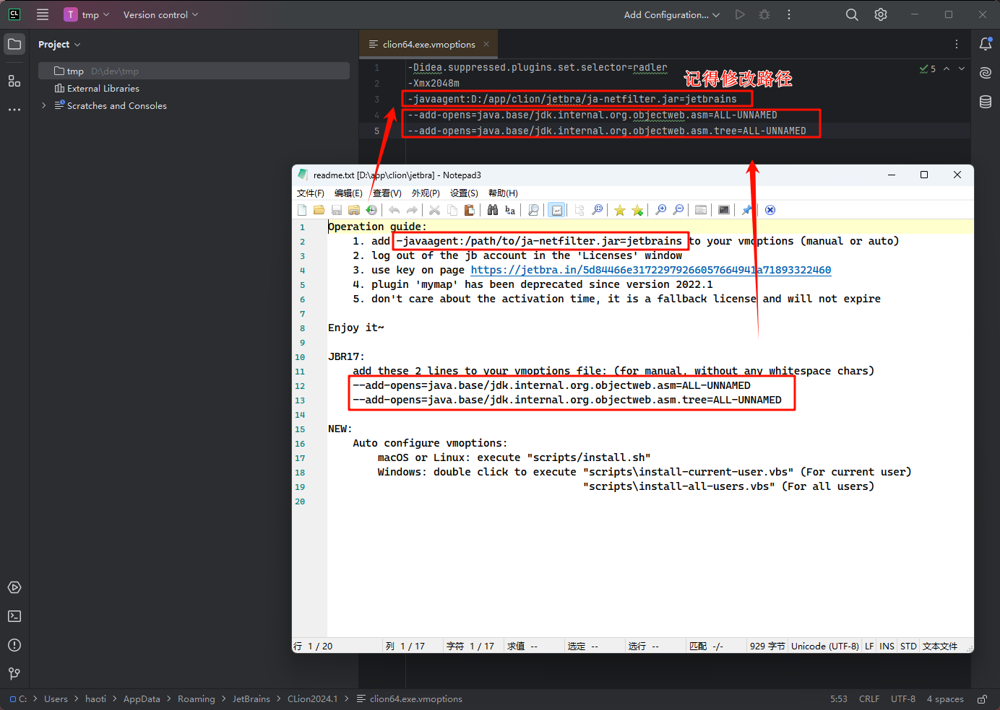
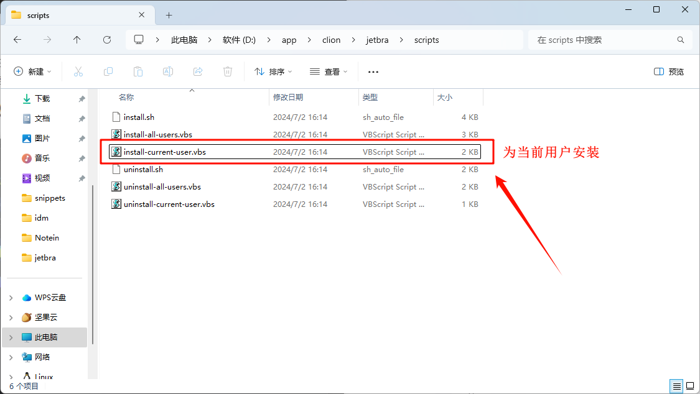
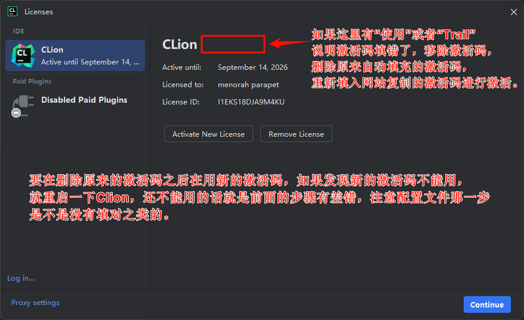

# JetBrains全家桶激活方法

这个方法的原理我也不是很懂，但是可能是目前为止最优雅的激活方式了。

参考文档如下：

[JetBrains全家桶激活方式](https://www.bilibili.com/read/cv27426430/)

[JETBRA.IN CHECKER | IPFS](https://3.jetbra.in/)

[ipfs/public-gateway-checker: Checks which public gateways are online or not (github.com)](https://github.com/ipfs/public-gateway-checker)

截止到【2024年8月3日】，我还没有研究过第三个地址的开源内容具体有什么用处（其实是研究了，但是没弄明白）。

---

# 正文

## 准备工作

首先需要有一个专业版的JetBrains软件，比如IDEA或者PyCharm。

打开上面的第二个地址，后，将会看到一个类似于导航的页面，每个链接前面都会有`Online`和`CORS`两列，当Online为一个地球图标而CORS为一个`*`号的时候，标明该地址可用，随机选择一个地址打开。

然后就可以到一个新的网页（如下）：

>   注意：这个网页后面还要用，在整个流程结束前不要关闭。

点击上面的zip链接，下载压缩包。解压后将得到一个`jetbra`文件夹（下面的截图是在完成激活后截图的，所以已经存放到PyCharm的目录下了）：

由于接下来的操作很多会发生在这个文件夹，所以建议将其放到JetBrains软件的根目录下（如上图）。

>   由于做笔记的时候已经激活过PyCharm了，所以接下来用Clion做演示。

## 激活操作

首先打开jetbra文件夹中的readme.txt文件，有两段内容需要注意：

如图所示，对于上述字段1，将`/path/to/`的路径改为该readme所在的路径（其实是改为后面的`ja-xxx`文件的路径，但是这个ja-xxx和readme是在同一个目录的），然后，准备好两个字段备用。

接下来打开安装好的IDE，启动试用，然后选择`帮助->编辑自定义虚拟机选项`。这样将会在IDE中打开一个新的文件如下图：

打开该文档以后，将修改好的字段1和字段2复制粘贴到该文件中，如下图：

修改结束后，保存该文件。

## 开始激活

回到`jetbra/scripts`文件夹，找到`install-current-user.vbs`程序并启动，等待大约1-2分钟后，将会出现一个`Done`字样的窗口，即可开始下一步。（注意，在Done之前，电脑不会有任何可以看见的反应，所以运行bat并且点击确认后，就不要在重复运行bat文件了）。

当安装好之后，回到前面下载zip的网页，找到对应软件的激活码，复制到软件中激活即可。（下面是激活成功后的样子，注意，没有试用标记）。

# 补充

## 关于一个设备上激活多个JetBrains软件的情况

在写这篇内容之前，我已经激活过了PyCharm，并且怀疑是否需要再次运行bat文件安装脚本，事实证明，在激活第二个软件（比如上面的CLion）的时候，重新运行一次bat是可以的，不会对前面已经激活的PyCharm造成影响，所以建议各装各的。

## 关于vbs脚本文件夹

在`scripts`文件夹中，不仅有install的vbs，也有uninstall的vbs，所以如果安装不成功，可以卸载脚本后，从头进行一次试试。

