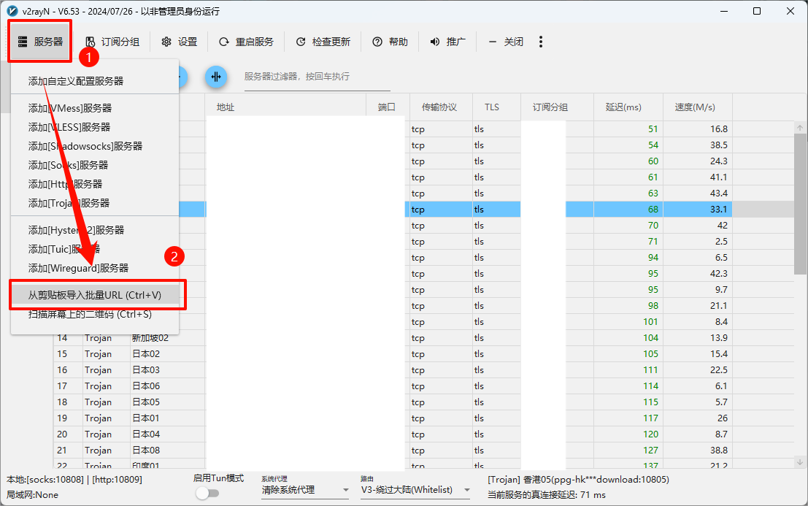
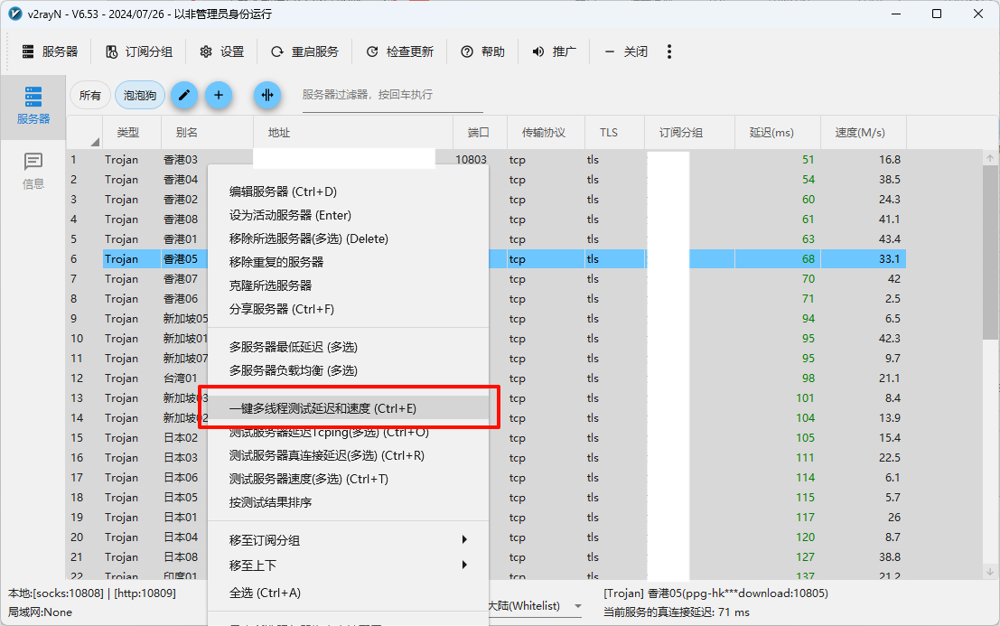
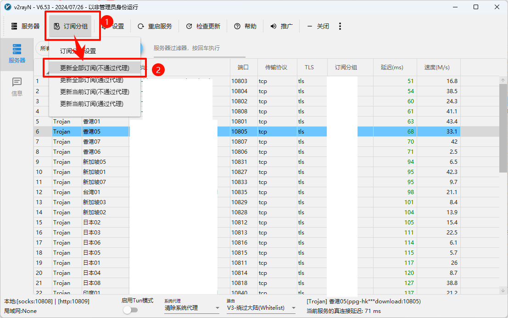

# 科学上网

科学上网方法记录。

目前比较简单的有两种方法，机场节点和VPN。下面会分别介绍。

## vpn

vpn是现成包装好的软件，基本上可以做到`打开软件，一键开启`的功能，对于质量较好的vpn，甚至可以做到无感使用。

推荐一个用了两年的[vpn](https://47.57.143.177/)（但是这并不代表这个vpn是干净和安全的，本人不对任何损失负责）。

## 节点

机场节点是另一种方法，机场一般都是私人创办，质量和价钱上都是参差不齐的，所以能达成什么样的科学上网体验，基本上就取决于你能收集到多少信息，进行多少实践活动。

### 获取节点

下面是两个比较推荐的机场：

-   [泡泡狗](https://github.com/cvmaoddg/paopaodog)：这个相对便宜，速度慢些。

    如果注册这个，推荐使用邀请码`AnRwZZQD`，或者在这个地址注册：`https://www.paopao.dog/#/register?code=AnRwZZQD`。

-   [白月光](https://ss.cn88.net/#/dashboard)：这个贵些，看用户群的情况，可能偶尔会断，但是总体质量会更好。

    如果注册这个，推荐使用邀请码`wXdngkJf`，或者在这个地址注册：`https://ss.cn88.net/#/register?code=wXdngkJf`。

>   使用邀请码对账号的质量不会有任何影响，大可放心使用。

### 获取软件

目前该方面常用的软件为`v2rayN`，安卓可以使用`v2rayNG`或者`surfboard`。（如果你使用鸿蒙，那么请放弃科学）。后面以windows端口的v2rayN为例，做简单说明。

首先到[2dust/v2rayN](https://github.com/2dust/v2rayN)获取软件。在`release`页面，选择`v2ray-with-core`的压缩包，并解压到任意位置。

从机场网站复制订阅链接。

打开v2rayN，从左上角导入剪贴板内容。

导入后，选择`订阅分组->更新全部订阅（不通过代理）`，刷新订阅链接。

更新后，就可以在列表中看到所有节点以及对应信息了。

使用`ctrl+a`全选节点，右键点击`一键多线程测试延迟和速度`，或者使用快捷键`ctrl+e`，刷新节点延迟。

一般情况下，建议选择延迟较低的节点。

选中一个节点，右键设置为活动服务器，即可完成配置。

在主窗口底部或者托盘图标右键，选择`自动配置系统代理`，即可完成配置，实现科学上网。

## warp

这个方法十分建议作为备用选项，因为该方法要想实现，必须首先能够科学上网，且拥有一个telegram账号。

待更新。