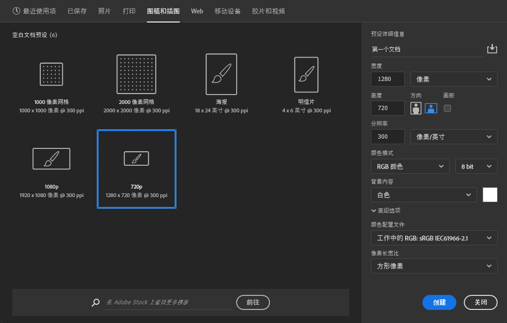

## 新建文档

通过菜单栏新建文档（或者使用快捷键`ctrl+n`）后，新建文档的窗口界面如下：

新建文档时，可以通过顶部的分类，选择预设好的文档尺寸，便于快速创建不同大小的内容。

在右侧的`预设详细信息`中，依次可以设置文档名、宽度高度及其单位、分辨率及其单位、颜色模式、背景内容、高级选项（通常不需要调整）。

下面是几种常用的分辨率设置：

-   洗印照片：300或者以上；
-   杂志、名片等印刷物：300；
-   海报高清写真：96-200；
-   网络图片、网页界面：72；
-   大型喷绘：25-50；

颜色模式：

-   RGB是从颜色发光的原理来设计的色彩模式，有R、G、B三种颜色，通过三种颜色混合实现不同的颜色显示，是广泛用于显示器的一种基本色彩模式。

    选择RGB的时候，一般选择8位即可。

-   CMYK是印刷色彩模式，由青色（cyan）、品红（magenta）、黄色（yellow）、黑色（black）油墨进行混合，表现出各种印刷颜色。

背景内容：

这里有几种不同的选择，其中，要注意的是，`背景色`是根据工具栏中的`前景色-背景色`部分确定的。

此外，通过`文档名`右侧的图标，可以存储预设，方便预设信息的复用。

## 修改图像大小

修改文档（图像）大小，通过`菜单栏->图像->图像大小`（或者快捷键`alt+ctrl+i`）打开图像大小设置窗口。

-   重新采样：重新采样默认是勾选的状态，取消该选项后，像素值将不可以被修改。
